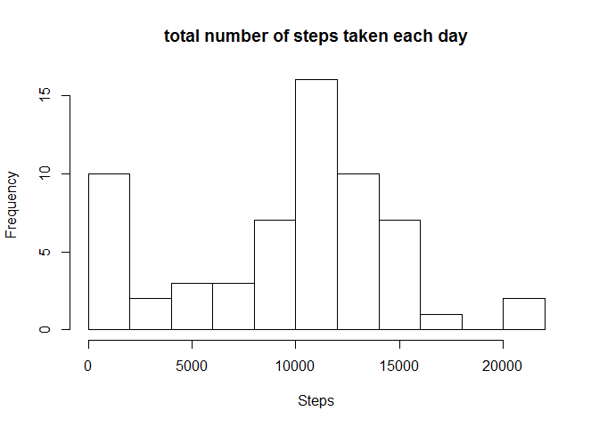
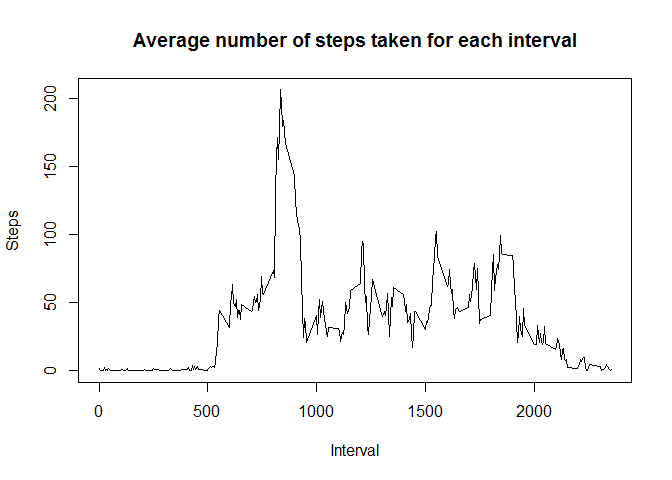
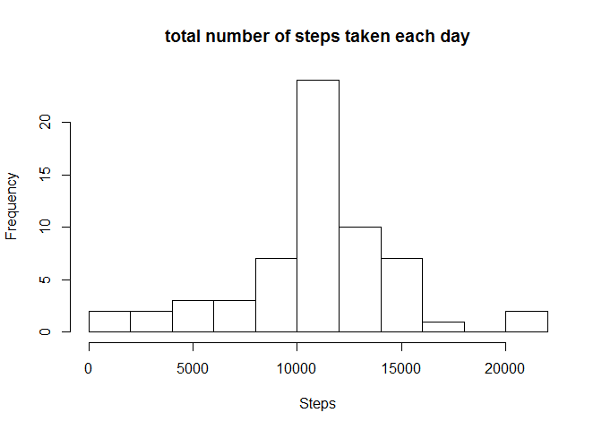
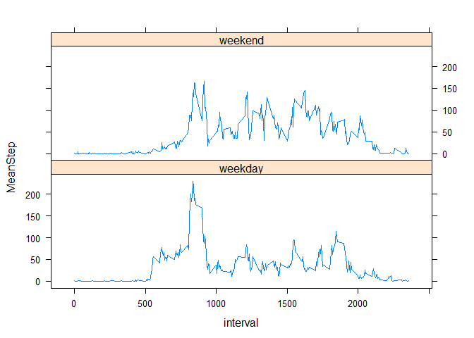

# Reproducible Research: Peer Assessment 1

This work try to answer some questions about data from a personal activity monitoring device. This device collects data at 5 minute intervals through out the day. The data consists of two months of data from an anonymous individual collected during the months of October and November, 2012 and include the number of steps taken in 5 minute intervals each day.

First we loaded the data and preprocessing the data in order to make the date field as date.


```r
library("dplyr")
```

```
## 
## Attaching package: 'dplyr'
## 
## The following object is masked from 'package:stats':
## 
##     filter
## 
## The following objects are masked from 'package:base':
## 
##     intersect, setdiff, setequal, union
```

```r
setwd("C:/Users/Pablo/RepData_PeerAssessment1/")
activity <- read.csv("activity.csv")
activity$date <- as.Date(activity$date)
```


The first question is What is mean total number of steps taken per day?
To answer this we group the data for each day and sum total number of steps for each day, then we plot an histogram and calculate the mean and median of the total number of steps taken per day:


```r
AgbyDate<-group_by(activity,date)
AgbyDateSuma<-summarize(AgbyDate,suma=sum(steps,na.rm=TRUE))

hist(AgbyDateSuma$suma,breaks = 15,main = "total number of steps taken each day",xlab = "Steps")
```

 

```r
mean(AgbyDateSuma$suma)
```

```
## [1] 9354.23
```

```r
median(AgbyDateSuma$suma)
```

```
## [1] 10395
```


Next question is, What is the average daily activity pattern?
So we calculate the average number of steps for each 5-minute interval for all days and make a plot with this "mean activity pattern". 


```r
AgbyInterval<-group_by(activity,interval)
AgbyIntervalMean<-summarize(AgbyInterval,MeanStep=mean(steps,na.rm=TRUE))
plot(AgbyIntervalMean$interval,AgbyIntervalMean$MeanStep,type="l",
     main="Average number of steps taken for each interval",xlab = "Interval",ylab="Steps")
```

 

The maximum number of steps occur during the 5-minute interval:


```r
filter(AgbyIntervalMean,MeanStep==max(AgbyIntervalMean$MeanStep))
```

```
## Source: local data frame [1 x 2]
## 
##   interval MeanStep
## 1      835 206.1698
```

For the previous calculations we have taking into account the NA values, now we report the total number of missing values in the dataset and generate a new data set "activity2" where the missing values have been replaced by the mean value of the corresponding 5-minute interval


```r
nrow(filter(activity,is.na(activity$steps)))
```

```
## [1] 2304
```

```r
activity2<-activity
activity2$date <- as.Date(activity2$date)
for (i in 1:nrow(activity2)) {
   if (is.na(activity2$steps[i])){
       activity2$steps[i]<-as.integer(filter(AgbyIntervalMean,interval==activity2$interval[i])[2])
    }
   
}
```

If we count again the missing values (over activity2 data set) we see that there are no one:


```r
nrow(filter(activity2,is.na(activity2$steps)))
```

```
## [1] 0
```


We perform again the first calculus performed over "activity", but in this case over "activity2" and plot an histogram and calculate the mean and median of the total number of steps taken per day. This time the histogram, mean and median change because of the missing values removal:


```r
A2gbyDate<-group_by(activity2,date)
A2gbyDateSuma<-summarize(A2gbyDate,suma=sum(steps))

hist(A2gbyDateSuma$suma,breaks = 15,main = "total number of steps taken each day",xlab = "Steps")
```

 

```r
mean(A2gbyDateSuma$suma)
```

```
## [1] 10749.77
```

```r
median(A2gbyDateSuma$suma)
```

```
## [1] 10641
```


The last question we want to answering is about differences in activity patterns between weekdays and weekends. In this case we first create a new factor variable in the original "activity" dataset that are "weekday" or "weekend". Then we perform again the same plot that we previously perform with the he average number of steps for each 5-minute interval for all days, but in this case there are two plots, one for the weekdays and other with weekend days:


```r
library(lattice)
activity2$weekday=ifelse(weekdays(activity2$date)=="sábado" | weekdays(activity2$date)=="domingo","weekend","weekday")
activity2$weekday<-as.factor(activity2$weekday)

Ag2WeekbyInterval<-group_by(activity2,interval,weekday)
Ag2WeekbyIntervalMean<-summarize(Ag2WeekbyInterval,MeanStep=mean(steps,na.rm=TRUE))
xyplot( MeanStep ~ interval | weekday, data = Ag2WeekbyIntervalMean, layout = c(1, 2),type="l")
```

 


